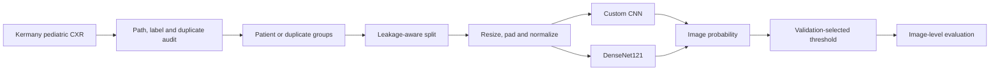

<div align="center">

# Pediatric Pneumonia Detection from Chest X-rays

**Image-level normal vs. pneumonia classification using the Kermany pediatric chest X-ray dataset**


</div>

---

## Overview

This project develops a reproducible deep-learning pipeline for classifying a pediatric chest X-ray as **normal** or **pneumonia**. It compares a custom convolutional neural network with an ImageNet-pretrained DenseNet121 under the same leakage-aware evaluation protocol.

> **Scope:** The dataset contains chest radiographs from children aged approximately 1-5 years. Results must not be generalized to adults or other clinical settings without external validation.

## Project at a glance

| Item | Selection |
|---|---|
| Dataset | Kermany pediatric chest X-rays, distributed on Kaggle |
| Source population | Guangzhou Women and Children's Medical Center, ages 1-5 |
| Task | Binary classification: normal / pneumonia |
| Prediction level | Image |
| Baseline | Custom small CNN |
| Main model | Pretrained DenseNet121 |
| Initial input | 224 x 224, aspect ratio preserved and padded |
| Input channels | Grayscale replicated to 3 channels |
| Split unit | Patient ID, with duplicate-group fallback |
| Primary metric | Macro F1 |
| Clinical metric | Pneumonia sensitivity |

## Pipeline



## Dataset caveats and split policy

The Kaggle archive contains `train`, `val`, and `test` folders, but the provided validation directory contains only 16 images. It is therefore not used as the project's model-selection validation set.

The completed audit found overlap in the provided split, so the committed
`split_v1` pools all source folders into **4,102 train / 877 validation / 877
test images**. Patient filename keys, exact hashes and recorded near-duplicate
groups are kept within one split. Use `data/manifests/{train,validation,test}.csv`
as the authority; the source folder in a relative image path is not its final
split. Do not regenerate the split for training.

Model selection, early stopping and threshold selection use validation only.

Reported image-level metrics:

- Macro F1
- Pneumonia sensitivity
- Specificity
- ROC-AUC
- PR-AUC
- Confusion matrix

## Repository structure

```text
.
|-- .github/
|   `-- pull_request_template.md
|-- configs/
|   |-- data.yaml
|   |-- baseline.yaml
|   `-- densenet121.yaml
|-- data/
|   |-- raw/                    # local only, ignored by Git
|   |-- manifests/
|   `-- README.md
|-- docs/
|   |-- TEAM_WORKFLOW.md
|   |-- GPU_GUIDE.md
|   |-- decisions.md
|   `-- experiment_registry.csv
|-- presentation/
|-- report/
|-- scripts/
|   |-- download_data.py
|   |-- train.py                # shared baseline / DenseNet training
|   `-- evaluate_model.py       # manifest-checked evaluation
|-- src/
|   |-- data/
|   |-- preprocessing/
|   |-- models/
|   |-- training/
|   `-- evaluation/
|-- tests/
|-- .env.example
|-- .gitignore
|-- CONTRIBUTING.md
|-- requirements.txt
`-- run_all.py
```

## Getting started

### 1. Clone the repository

```bash
git clone https://github.com/Medical-Xray-AI/pneumonia-xray.git
cd pneumonia-xray
```

### 2. Install the project dependencies

```bash
python -m pip install -r requirements.txt
```

### 3. Download the dataset locally

Every team member must download the pinned Kaggle Version 2 on their own computer. The dataset is public, so start without authentication:

```bash
python scripts/download_data.py
```

If Kaggle explicitly returns an authorization error, retry once with `python scripts/download_data.py --login`. The login validation is deferred to the actual download request. Later runs reuse an already valid local copy without downloading or overwriting it.

The command downloads into the Git-ignored `data/raw/kaggle/` directory, validates all expected class counts, finds the actual `chest_xray` root, and writes that path to the local `.env`. It never writes Kaggle credentials to the repository.

If the dataset was already downloaded elsewhere:

```bash
python scripts/download_data.py --data-root "/absolute/path/to/chest_xray"
```

### 4. Optional manual path configuration

The download command updates `.env` automatically. To configure it manually, copy the template:

```bash
# Windows CMD
copy .env.example .env

# Linux/macOS
cp .env.example .env
```

Edit `.env` and point it to the extracted `chest_xray` directory and a machine-local output directory:

```env
XRAY_DATA_ROOT=/path/to/chest_xray
XRAY_OUTPUT_ROOT=outputs
XRAY_NUM_WORKERS=4
```

The real `.env` file must remain local and must never be committed.

### 5. Check the GPU environment

Before installing or upgrading PyTorch on the shared GPU server, follow [`docs/GPU_GUIDE.md`](docs/GPU_GUIDE.md). Dependency versions remain provisional until the server's Python, CUDA, PyTorch, and torchvision versions have been audited.

### 6. Verify the repository entry point

```bash
python run_all.py --check
```

`run_all.py` is still a config-existence check. Train and evaluate using the
working commands below (set the environment variables in your shell first):

```bash
python scripts/train.py --config configs/baseline.yaml --run-id baseline_run
python scripts/train.py --config configs/densenet121.yaml --run-id densenet_run
python scripts/evaluate_model.py validation \
    --predictions small_cnn=$XRAY_OUTPUT_ROOT/baseline_run/predictions_val.csv \
    --predictions densenet121=$XRAY_OUTPUT_ROOT/densenet_run/predictions_val.csv \
    --manifest data/manifests/validation.csv --out-dir report
```

See [training and resume usage](docs/training_protocol.md) for PowerShell,
output paths and reproducible resume. See [evaluation protocol](docs/evaluation_protocol.md)
for the frozen-model contract. Full dataset results are produced by actual
training runs; synthetic checks are not project performance results.

## Dataset

The approved dataset is pinned as `paultimothymooney/chest-xray-pneumonia/versions/2`. Download it with `python scripts/download_data.py`; do not manually copy it into Git. The local `XRAY_DATA_ROOT` will point to:

```text
chest_xray/
|-- train/
|   |-- NORMAL/
|   `-- PNEUMONIA/
|-- val/
|   |-- NORMAL/
|   `-- PNEUMONIA/
`-- test/
    |-- NORMAL/
    `-- PNEUMONIA/
```

Official and distribution resources:

- [Kaggle: Chest X-Ray Images (Pneumonia)](https://www.kaggle.com/datasets/paultimothymooney/chest-xray-pneumonia)
- [Original Mendeley Data release](https://data.mendeley.com/datasets/rscbjbr9sj/3)
- [Kermany et al., Cell (2018)](https://doi.org/10.1016/j.cell.2018.02.010)

See [`data/README.md`](data/README.md) for the data policy and [`data/manifests/README.md`](data/manifests/README.md) for the manifest contract.

The canonical audit, manifests and shared dataset API are integrated.
Run `python scripts/verify_manifests.py` to verify the split metadata.

## Reproducibility

Every meaningful experiment must record:

- Git commit SHA
- Config file and random seed
- Split version
- Device and peak GPU memory
- Training duration and best epoch
- Validation metrics
- External checkpoint location

Runs are tracked in [`docs/experiment_registry.csv`](docs/experiment_registry.csv). Large outputs and checkpoints remain outside Git.

## Team workflow

Development is branch- and pull-request-based. Direct development on `main` is avoided after the initial bootstrap, and each pull request requires at least one teammate review.

- [Team roles and integration gates](docs/TEAM_WORKFLOW.md)
- [Contribution and review rules](CONTRIBUTING.md)
- [Technical decision log](docs/decisions.md)

## Project status

- [x] Repository structure and security rules
- [x] Shared data and experiment configurations
- [x] Reproducible local Kaggle download and inventory validation entry point
- [x] Team workflow and GPU guidance
- [x] Dataset audit and leakage-safe manifests
- [x] Custom CNN baseline
- [x] DenseNet121 training pipeline
- [x] Image-level evaluation and interpretation
- [ ] End-to-end inference and clean-clone verification
- [ ] Final report and presentation

## Security and data policy

Do **not** commit raw X-rays, processed datasets, patient information, model checkpoints, `.env` files, VPN configurations, private keys, Jupyter tokens, or Kaggle credentials.

## Disclaimer

This repository is an educational research project. Its outputs are not validated for clinical use and must not be used for medical diagnosis or treatment decisions.
